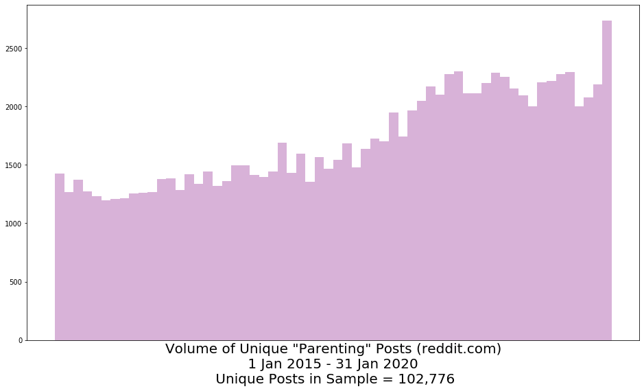
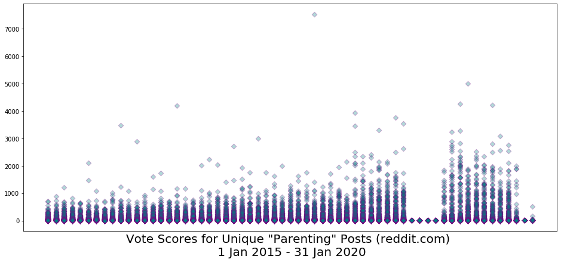

# lda_topic_model_pfp
Web scrape, EDA, pre-processing, and topic modeling using LDA for a client project with Python.

## 1.0 Table of Contents
[1.0 Table of Contents] 
[2.0 Project Outline / Problem Statement] 
[3.0 The Data] 
--[3.1 Data Visualizations] 
[4.0 Modeling and Analysis] 
[5.0 Next Steps] 
[6.0 Outside Sources] 

----

## 2.0 Project Outline / Problem Statement
The client, a digital parenting advice and community platform, was interested in learning if there were any gaps in thier content, in terms of relevant topics for their users.  To this end, topic modeling was performed on a sample of posts from the reddit.com parenting group to identify the general topics of interest among this population and validate the client's topical strategy.  The resulting topics produced by the analysis will then be reviewed against the client's content for gap analysis and will serve as a basis for possible product modification or extention.

To this end, Latent Dirichlet Allocation (LDA) will be leveraged to generate the topic clusters present in the reddit parenting posts.

## 3.0 The Data
The data in this analysis consists of forum posts obtained from reddit.com sub-reddits …

- r/parenting

Approximately 103K submissions (i.e. unique posts) were obtained from posts made between 01 Jan 2015 and 31 Jan 2020.

Post-processing dimensions:

- 102,776 rows
- 1,659 columns (i.e. this is the size of the LDA model "vocabulary")

### 3.1 Data Visualizations

**Fig. 1** above illustrates the increasing trend in posting activity in the parenting forum between Jan, 2015 and Jan, 2020.

**Fig. 2** above suggests that not only is the volume of posts increasing in this time perioud, but the level of interest in parenting topics and/or advice for parents is also growing, reinforcing the trend perspective in Figure 1.

## 4.0 Modeling and Analysis
- Gensim and Scikit Learn LDA clustering (i.e. topic modeling) algorithms
    - Experimentsd with multiple values for topic number: 8, 10, 12, 15, 18, 20, 24, 30

### 4.1 Summary of findings
The LDA topic model with N=12 (number of topics) performed best in terms of the following criteria:

- Coherence score = 0.45
- Visual inspection of the clusters (as modeled using pyLDAvis)
- interpretability of the majority of the clusters returned, in terms of the top 30 words associated with each cluster and the corresponding word weights.

Interestingly, the overall performance of the 12-topic model vs. several of the others was not that different.  The 18-topic model, for example, also performed defensibly well, with the added potential bonus of more granular topic clusters (though not as cleanly separated, which could make classification modeling challenging, were that a next step in the client's business needs, which in this case, it was not).

Please refer to the presentation included in the repo for more detail.

## 5.0 Summary of next steps
- Cluster topics in client’s content modules
    - Compare topics across the two corpora
    - Determine if there are any gaps in relevant topic areas
- Explore optimization possibilities to improve the clustering model performance …
- Additional removal of high frequency (non-stopword) terms to see if that impacts the separability/cleanliness of the topic clusters
- Additional hyperparameter tuning

## 6.0 Resources
- client website (redacted to avoid searchability at the client's request).
- www.reddit.com/r/parenting
- https://scikit-learn.org/stable/modules/decomposition.html#latentdirichletallocation
- Kapadia, “Topic Modeling in Python: Latent Dirichlet Allocation (LDA)”; https://towardsdatascience.com/end-to-end-topic-modeling-in-python-latent-dirichlet-allocation-lda-35ce4ed6b3e0
- https://stackoverflow.com/questions/46326173/understanding-lda-topic-modelling-too-much-topic-overlap
- Xiaohui Yan, et al, “A Biterm Topic Model for Short Texts”; http://citeseerx.ist.psu.edu/viewdoc/download?doi=10.1.1.402.4032&rep=rep1&type=pdf

---
